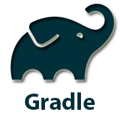
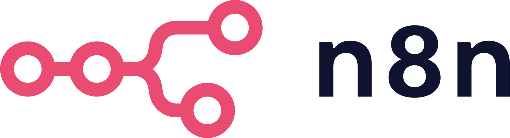

<!-- BANNER TOPO (AMARELO) -->

  

<!-- FRASE ANIMADA -->

  

<!-- BOTÕES -->

  
  
  
  
  

<!-- CONTADORES -->

  
  
  

### 🧠 Sobre mim:
Sou **Otávio Guedes**, desenvolvedor **Back-end Java**, **estagiário na NicolaSec** e estudante de Engenharia de **Engenharia de Software**.

Gosto de resolver problemas reais: já entreguei projetos full-stack completos, do backend com **Java** e **Spring Boot** até o deploy em produção, passando por **PostgreSQL**, **Docker** e integração com **APIs de IA**. Tudo isso com versionamento sério no **Git** e testes automatizados com **JUnit** e **Mockito**.

Sou exigente com a qualidade do que escrevo: prezo por código limpo, arquitetura bem pensada e sistemas que funcionam de verdade, não só "no papel". Por isso também curto compartilhar o que aprendo, seja no meu perfil de dev ou criando conteúdo técnico para outros iniciantes.

Atualmente estou aprofundando meus estudos em **Redis**, **Kafka** e **Kubernetes**, buscando entender na prática como construir sistemas distribuídos, escaláveis e resilientes.

---

### 🛠️ Tecnologias & Ferramentas

<table style="border-collapse: collapse; width: 100%;">
  <thead>
    <tr>
      <th width="33%">💻 Back-end</th>
      <th width="33%">🎨 Front-end</th>
      <th width="33%">📚 Frameworks & Testes</th>
    </tr>
  </thead>
  <tbody>
    <tr>
      <td align="center">
        &nbsp;&nbsp;
        &nbsp;&nbsp;
        
      </td>
      <td align="center">
        &nbsp;&nbsp;
        &nbsp;&nbsp;
        &nbsp;&nbsp;
        
      </td>
      <td align="center">
        &nbsp;&nbsp;
        &nbsp;&nbsp;
        &nbsp;&nbsp;
        
      </td>
    </tr>
  </tbody>
</table>

<table style="border-collapse: collapse; width: 100%;">
  <thead>
    <tr>
      <th width="33%">🗄️ Banco de Dados</th>
      <th width="33%">🧰 IDE's</th>
      <th width="33%">☁️ DevOps</th>
    </tr>
  </thead>
  <tbody>
    <tr>
      <td align="center">
        &nbsp;&nbsp;
        &nbsp;&nbsp;
        
      </td>
      <td align="center">
        &nbsp;&nbsp;
        &nbsp;&nbsp;
        
      </td>
      <td align="center">
        &nbsp;&nbsp;
        &nbsp;&nbsp;
        &nbsp;&nbsp;
        &nbsp;&nbsp;
        &nbsp;&nbsp;
        
      </td>
    </tr>
  </tbody>
</table>

<table style="border-collapse: collapse; width: 100%;">
  <thead>
    <tr>
      <th width="33%">⚙️ Build Tools</th>
      <th width="33%">🤖 IA & Automação</th>
      <th width="33%">🎯 Estudando</th>
    </tr>
  </thead>
  <tbody>
    <tr>
      <td align="center">
        &nbsp;&nbsp;
        
      </td>
      <td align="center">
        &nbsp;&nbsp;
        &nbsp;&nbsp;
        &nbsp;&nbsp;
        &nbsp;&nbsp;
        
      </td>
      <td align="center">
        &nbsp;&nbsp;
        
      </td>
    </tr>
  </tbody>
</table>

---

### 🚀 Meus melhores projetos

<table>
  <tr>
    <td align="center">
      <a href="https://otavio2704.github.io/cvibe-web/">
        
          📄 <strong>CVibe</strong>
      </a>
       
      Plataforma full-stack de otimização de currículos para o ATS da Gupy. Backend em Spring Boot integrado à NVIDIA NIM, frontend em React + TypeScript e deploy completo em produção.
    </td>
    <td align="center">
      <a href="https://github.com/Otavio2704/kytrionyx-ai">
        
          🤖 <strong>Kytrionyx AI</strong>
      </a>
       
      Chatbot local para modelos open source via Ollama. Backend reativo com Java 17 + Spring Boot WebFlux, histórico de conversas em PostgreSQL e suporte a i18n em 7 idiomas.
    </td>
  </tr>

  <tr>
    <td align="center">
      <a href="https://github.com/Otavio2704/Gamify-API--GaaS">
        
          🎮 <strong>GamifyAPI - GaaS</strong>
      </a>
       
      API REST de gamificação multi-tenant como serviço. Autenticação dupla com JWT + API Key, webhooks assíncronos com retry exponencial e rankings em tempo real.
    </td>
    <td align="center">
      <a href="https://github.com/Otavio2704/CommitGen-AI">
        
          🤖 <strong>CommitGen AI</strong>
      </a>
       
      Ferramenta que gera mensagens de commit a partir de um Git Diff, usando IA para interpretar as mudanças no código.
    </td>
  </tr>

  <tr>
    <td align="center">
      <a href="https://github.com/Otavio2704/Roguelike-Java">
        
          🗡️ <strong>Roguelike-Java</strong>
      </a>
       
      Jogo roguelike em Java com geração procedural de mapas, sistema de combate tático e IA de inimigos.
    </td>
    <td align="center">
      <a href="https://github.com/Otavio2704/Galope-Furioso">
        
          🐎 <strong>Galope Furioso</strong>
      </a>
       
      Simulador de corrida de cavalos em Java, rodado direto no terminal.
    </td>
  </tr>

  <tr>
    <td align="center">
      <a href="https://github.com/Otavio2704/Gerenciador-de-Times-e-Jogadores">
        
          ⚽ <strong>Gerenciador de Times e Jogadores</strong>
      </a>
       
      Sistema completo para gerenciar times de futebol com persistência de dados.
    </td>
    <td align="center">
      <a href="https://github.com/PandaLoko27/sistema-bancario-java-poo">
        
          🏦 <strong>Sistema Bancário com Java</strong>
      </a>
       
      Simulação de um sistema bancário simples em Java, aplicando conceitos de POO.
    </td>
  </tr>
</table>

---

## 🚀 Minhas estatísticas no GitHub

  
  

  

---

### 🐍 Minhas contribuições

  

### 📫 Vamos nos conectar?

  
  &nbsp;&nbsp;&nbsp;
  
  &nbsp;&nbsp;&nbsp;
  
  &nbsp;&nbsp;&nbsp;
  
  &nbsp;&nbsp;&nbsp;
  

  <strong>Aberto a networking, projetos e oportunidades em Back-end Java.</strong> 
  Se tiver interesse, é só me chamar 👊

---

  

