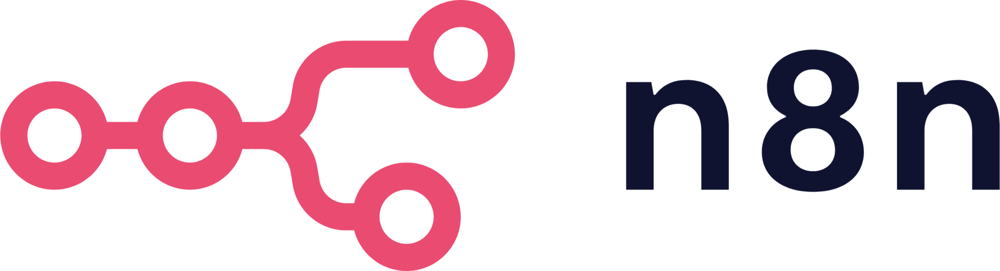

<!-- BANNER TOPO (AMARELO) -->

  

<!-- FRASE ANIMADA -->

  

<!-- BOTÕES -->

  
  
  
  

<!-- CONTADORES -->

  
  
  

### 🧠 Sobre mim:

Sou **Otávio Guedes**, desenvolvedor **Back-end** apaixonado por construir sistemas que realmente funcionam bem não só por fora, mas por dentro também. Tenho experiência prática com **Java**, **Spring Boot**, **SQL** e **APIs RESTful**, e uso **Docker** para garantir que minhas aplicações rodem do mesmo jeito em qualquer ambiente.

Acredito que código bom é código testável: por isso me dedico a escrever testes com **JUnit** e **Mockito**. Estou sempre expandindo meu horizonte. Hoje explorando **Linux** e me aprofundando em arquiteturas mais robustas com **Kubernetes** e **Kafka**.

Uso **IA** (ChatGPT, Claude) como uma aliada no aprendizado e na produtividade, não como muleta. No fim do dia, o que me move é a busca por **soluções bem estruturadas** e a sensação de que hoje fui melhor do que ontem.

---

### 🛠️ Tecnologias & Ferramentas

<table style="background-color: white; border-collapse: collapse; width: 100%;">
  <thead>
    <tr>
      <th width="10%">💻 Back-end</th>
      <th width="10%">🎨 Front-end</th>
      <th width="10%">📚 Frameworks</th>
      <th width="10%">🧪 Testes Unitários</th>
      <th width="10%">🧰 IDE's</th>
      <th width="10%">🗄️ Banco de Dados</th>
      <th width="10%">☁️ DevOps</th>
      <th width="10%">⚙️ Build Tools</th>
      <th width="10%">🧪 Outras Tecnologias</th>
      <th width="10%">🎯 Em Aprendizado</th>
    </tr>
  </thead>
  <tbody>
    <tr>
      <td align="center">
         Python
          
         Java
      </td>
      <td align="center">
         HTML
          
         CSS
          
         JavaScript
      </td>
      <td align="center">
         Spring Boot
      </td>
      <td align="center">
         JUnit
          
         Mockito
      </td>
      <td align="center">
         VSCode
          
         PyCharm
          
         IntelliJ IDEA
      </td>
      <td align="center">
         PostgreSQL
          
         DBeaver CE
      </td>
      <td align="center">
         AWS
          
         Git
          
         GitHub
          
         Docker
      </td>
      <td align="center">
         Gradle
          
         Maven
      </td>
      <td align="center">
         ChatGPT
          
         Claude
          
         Windows
          
         n8n
      </td>
      <td align="center">
         Kubernetes
          
         Kafka
          
         Redis
      </td>
    </tr>
  </tbody>
</table>

---

### 🚀 Meus melhores projetos

<table>
  <tr>
    <td align="center">
      <a href="https://github.com/Otavio2704/Roguelike-Java">
        
          🗡️ <strong>Roguelike-Java</strong>
      </a>
       
      Jogo roguelike completo com geração procedural, sistema de combate tático, IA de inimigos e progressão com loja de power-ups.
    </td>
    <td align="center">
      <a href="https://github.com/Otavio2704/API-AmigoSecreto2.0-Natal">
        
          🅠<strong>Amigo Secreto 2.0 - API REST</strong>
      </a>
       
      API para criação de grupos, cadastro de participantes, sorteio inteligente e envio de mensagens anônimas com temática natalina.
    </td>
  </tr>
  <tr>
    <td align="center">
      <a href="https://github.com/Otavio2704/Gerenciador-de-Times-e-Jogadores">
        
          ⚽ <strong>Gerenciador de Times e Jogadores</strong>
      </a>
       
      Sistema completo para gerenciar times de futebol com persistência de dados.
    </td>
    <td align="center">
      <a href="https://github.com/PandaLoko27/AcademiaGYM--APIrest">
        
          🏋️‍♂️ <strong>Academia de ginástica - API REST</strong>
      </a>
       
      API RESTful com Spring Boot para controle de alunos, treinos e matrículas de uma academia de ginástica.
    </td>
  </tr>
  <tr>
    <td align="center">
      <a href="https://github.com/PandaLoko27/sistema-bancario-java-poo">
        
          🦠<strong>Sistema Bancário com Java</strong>
      </a>
       
      Simulação de um banco simples, feito com Java.
    </td>
    <td align="center">
      <a href="https://github.com/Otavio2704/meu--site">
        
          💼 <strong>Site Portfólio</strong>
      </a>
       
      Meu site pessoal com projetos e informações profissionais.
    </td>
  </tr>
  <tr>
    <td align="center">
      <a href="https://github.com/Otavio2704/BancoDeDados--Ecommerce--PostgreSQL">
        
          🛒 <strong>Banco de dados E-commerce</strong>
      </a>
       
      Sistema completo de banco de dados para e-commerce com PostgreSQL
    </td>
    <td align="center">
      <a href="https://github.com/Otavio2704/BancoDeDados--Oficina--PostgreSQL">
        
          🔧 <strong>Banco de dados Oficina</strong>
      </a>
       
      Modelo de banco de dados para gestão de uma oficina mecânica com PostgreSQL.
    </td>
  </tr>
</table>

---

## 🚀 Minhas estatísticas no GitHub

  
  

  

---

### 🐍 Minhas contribuições

  

---

### 📫 Vamos nos conectar?

  
  &nbsp;&nbsp;&nbsp;
  

  <strong>Aberto a networking, projetos e oportunidades em Back-end Java.</strong> 
  Se fizer sentido pra você, me chama 👊

---

  

